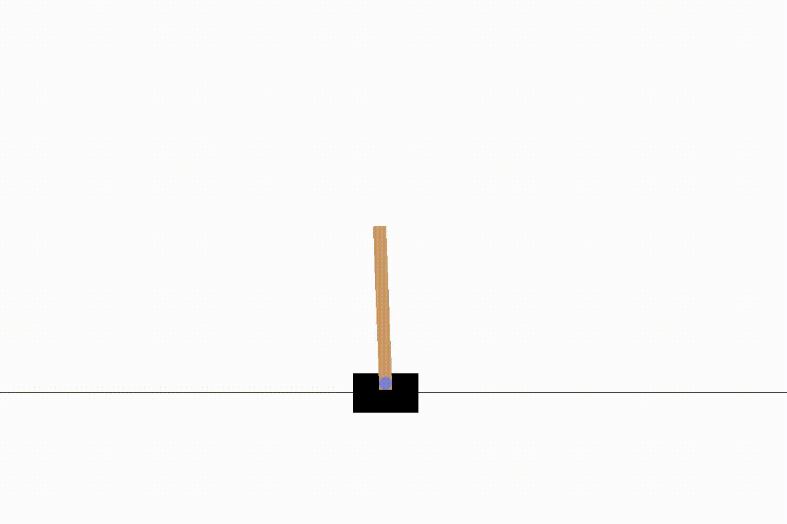

# Reading Diary

This my repo where I store my notes alongside with the sample codes from the book "Applied Reinforcement Learning with Python" by Beysolow & Taweh. 

### Chapter 2: Reinforcement Learning Alogrithms

[Notebook Chapter 2: Cart Pole](Chapter2.ipynb)

Gradient Ascent Applied to Policy Optimization to solve the cart pole task. The result is a shallow neural network appliying horizonal force to a waggon trying to balance a pole for 200 consecutive  time steps. 

The neural network takes the state as input and outputs the action in terms of a probability distribution over the action space. The Reinforment-Learner was Trained over 50'000 Episodes. For training a Google Cloud VM has been used. My notes on how to access Google Cloud VM for Training is here:

[Setup SSH Connection to GCP](tools/GCP.md)

